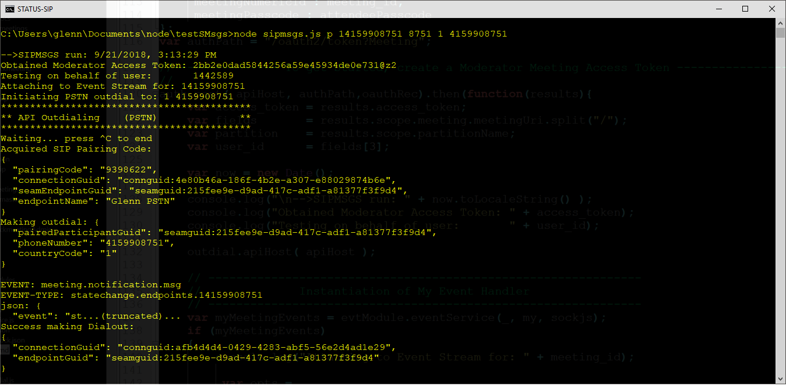

# BlueJean Outdial Status Event Monitor


## Reference Design for Monitoring BlueJeans SIP and PSTN Outdial Call Progress States

- 9/21/2018, g1, Initial check-in

This Node JS application demonstrates how to stimulate an outdial from a BlueJeans Meeting, and to monitor the associated Call Progress States for the outdial.  The callout can occur either through standard PSTN telephony lines, or through a SIP dialout.

The Call Progress States are returned to the application layer through the BlueJeans' Events mechanism.  They are indicated in the **meeting.notification.msg** event, under the subtype, **dialout.notification** header.

The output from the start of a PSTN outdial test is shown here:




When an outdial call progress state event message is received, the application will display this information

```javascript
EVENT: meeting.notification.msg
EVENT-TYPE: dialout.notification
json: {
  "event": "dialout.notification",
  "statusCode": "102",
  "status": "answered"
}
```


### To Install

1. Download the files from this git repository
2. give the command `npm install`

### To Run
The application is contained in the eventmon.js file.  It requires the BlueJeans numeric meeting ID as a parameter when launching:  

`node sipmsgs.js ?`  -- to see the command line options/help

The command line parameters are defined as follows:

- numeric_meeting_id  -- The ID number of a current BlueJeans Meeting
- moderator_passcode -- the access code for the specified meeting ID that grants moderator privileges
- uri -- the fully qualified SIP resource identifier for where to send the outdialed call
- cc -- the telephonic country code for where to place a PSTN call
- phnum -- the device telephone number (including area codes, etc, with no whitespacings) for where to place a PSTN call 


#### To make a SIP outdial

Use this command-line option to cause BlueJeans to make an outdial to a SIP URI:

`node sipmsgs.js s <numeric_meeting_id> <moderator_passcode> <uri>`


#### To make a PSTN outdial

Use this command-line option to cause BlueJeans to make an outdial to a SIP URI:

`node sipmsgs.js p <numeric_meeting_id> <moderator_passcode> <cc> <phnum>`


### BlueJean Call State Definitions

The following example lists the defined states and their numerical values associated with the initiation and progress of outdialing.

```javascript
var statusCodes = {
	dialing   : "100",
	ringing   : "101",
	answered  : "102",
	completed : "103",
	cancelled : "104",
	failed    : "105",
	busy      : "106",
	noanswer  : "107",
	rejected  : "108"
};
```


### In-Application Commands
When sipmsgs running, the following keys are enabled:


| Keystroke | Command                   |
| --------- | ------------------------- |
| Ctrl-C    | Terminate the application |


